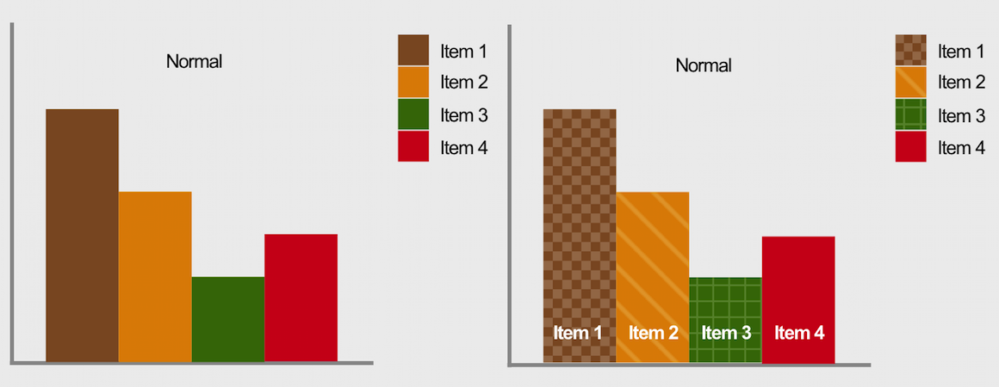

# Empath

## See the web through the eyes of others.

Empath is a web browser that uses various technologies to simulate the mismatch between the diversity of human capabilities and the internet.

Empath allows web developers to experience their project the way someone else may experience it, by simulating common disabilities.

Our goal with Empath is to build empathy and promote inclusion. We want to change the way technology professionals think about inclusive design.

---

The images below are used to diagnose common forms of color blindness. Use the tools in Empath to view these images as they appear to other people. Can you identify ways in which these images lose their meaning?





See [the website](https://13protons.github.io/empath/) for more info and visual examples.

> Note: this project is in early stages. Drop a line if you'd like to help out!

#### Build Setup

``` bash
# install dependencies
npm install

# serve with hot reload at localhost:9080
npm run dev

# build electron application for production
npm run build

# run unit & end-to-end tests
npm test


# lint all JS/Vue component files in `src/`
npm run lint

```

---

This project was generated with [electron-vue](https://github.com/SimulatedGREG/electron-vue)@[8fae476](https://github.com/SimulatedGREG/electron-vue/tree/8fae4763e9d225d3691b627e83b9e09b56f6c935) using [vue-cli](https://github.com/vuejs/vue-cli). Documentation about the original structure can be found [here](https://simulatedgreg.gitbooks.io/electron-vue/content/index.html).
